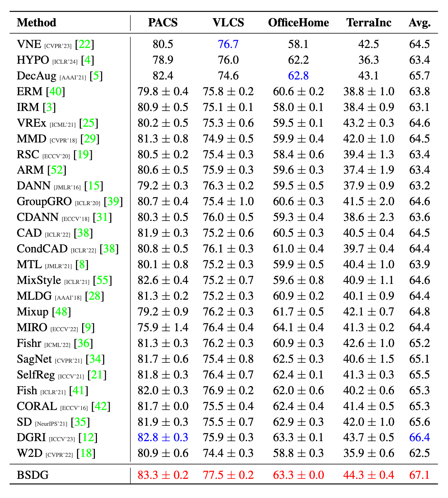

# Enlarging Fetaure Support Overlap for Domain Generalization

Official PyTorch implementation of Enlarging Fetaure Support Overlap for Domain Generalization


## Introduction

 An example of enlarging the feature support overlap for domain generalization.
 The left subfigure shows the situation when insufficient support overlap, resulting in a failed generalization regardless of which domain is used for modeling; the red line indicates the decision boundary.
 The right subfigure shows an example of successful generalization when sufficient support overlap.


The figure above shows how BSDA works, and the example of input image is a ragdoll cat named Xiao Ming.

## Results




## Quick start

Download the datasets:
```
python -m domainbed.scriptss.download --data_dir=./domainbed/data
```

Train a model:
```
python3 -m domainbed.scripts.train \
       --data_dir=./domainbed/data/MNIST/ \
       --algorithm BSDG \
       --dataset ColoredMNIST \
       --test_env 2
```
 
Launch a sweep:

```
python -m domainbed.scripts.sweep launch \
       --data_dir=domainbed/data  \
       --output_dir=./result \
       --command_launcher multi_gpu \
       --algorithms ERM IRM BSDG \
       --datasets TerraIncognita \
       --n_hparams 5 \
        --n_trials 3
```

After all jobs have either succeeded or failed, you can delete the data from failed jobs with python -m domainbed.scripts.sweep delete_incomplete and then re-launch them by running python -m domainbed.scripts.sweep launch again. Specify the same command-line arguments in all calls to sweep as you did the first time; this is how the sweep script knows which jobs were launched originally.

To view the results of your sweep:

```
python -m domainbed.scripts.collect_results\
       --input_dir=./result
```

## Acknowledgment

The implementation is based on [DomainBed](https://github.com/facebookresearch/DomainBed)

